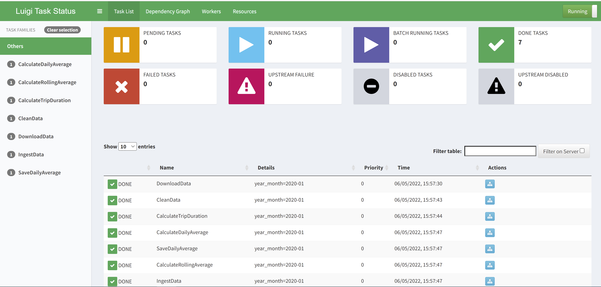
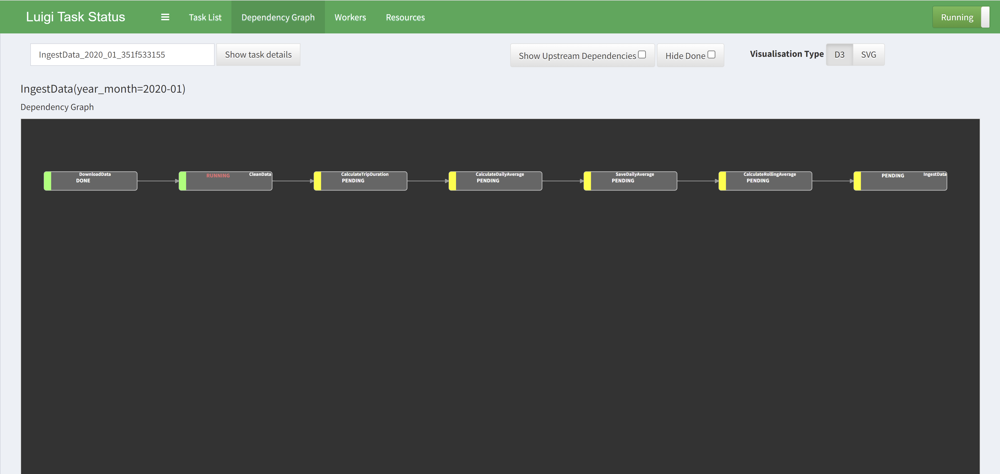
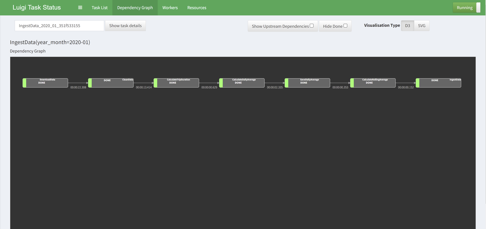

# A simple data pipeline for TLC Trip Record Data using Luigi

[Luigi](https://github.com/spotify/luigi) is used for building the data pipeline to ingest new data.

## Required

- Create a conda environment or python virtual environment.

## Installation steps

- $ cd <root_directory>/src
- $ conda env create -f environment.yml (if using a conda environment)
- $ pip install -r requirements.txt (if using python virtual environment)
- $ set PYTHONPATH=%cd%;%PYTHONPATH% (only for windows OS)

## Usage

Here --date should be in YYYY-MM format.

### Running a Luigi Scheduler

1. In Windows
    - $ luigid --port 8082
2. In Linux/Mac
    - $ sudo ufw allow 8082/tcp
    - $ sudo sh -c ". luigi-venv/bin/activate ;luigid --background --port 8082"
    - $ luigid --port 8082 > /dev/null 2> /dev/null &

### Launch the Luigi Interface

Open a browser to access the Luigi interface. This will either be at http://your_server_ip:8082, or if you have set up a domain for your server http://your_domain:8082. 

### Data pipeline to ingest new data and calculate the rolling average for 45 days.

- luigi --module ingest_data IngestData --year-month 2020-01
- luigi --module ingest_data IngestData --year-month 2020-02
- luigi --module ingest_data IngestData --year-month 2020-03

 The above command is ran three times as shown above to ingest data for 3 months and calculate the rolling average for 45 days. 

## Running Unittests

- $ cd <root_directory>
- $ pytest

## Luigi Interface 

The Luigi server comes with a web interface as seen below, so we can search and filter among all our tasks.

## Dependency Graph

Using Luigi's visualiser, we get a nice visual overview of the dependency graph of the workflow. Each node represents a task which has to be run. Green tasks are already completed whereas yellow tasks are yet to be run. 

